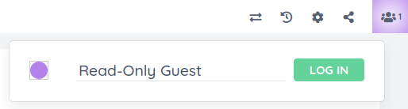

 

# ep\_readonly\_guest



Etherpad plugin that grants read-only access to users that are not logged in.

When a user first visits Etherpad, they will be "authenticated" as a guest user
that does not have permission to create or modify pads. A "log in" button in the
user drop-down list forces the user to authenticate via Etherpad's built-in HTTP
basic authentication or via an authentication plugin (if one is installed).
After logging in, the "log in" button becomes a "log out" button.

## Configuration

Etherpad's `requireAuthentication` setting must be `true`. All
ep\_readonly\_guest settings are optional, with the defaults shown below:

```json
  "ep_readonly_guest": {
    "guest_username": "guest",
    "guest_displayname": "Read-Only Guest"
  },
  "requireAuthentication": true,
```

* `guest_username` is the username used for the guest account.
* `guest_displayname` is the name that appears in the user drop-down list for
  guest users. Guests are unable to change the name unless this is set to
  `null`.

## Copyright and License

Copyright © the ep\_reaonly\_guest authors and contributors

Licensed under the [Apache License, Version 2.0](LICENSE) (the "License"); you
may not use this file except in compliance with the License. You may obtain a
copy of the License at

http://www.apache.org/licenses/LICENSE-2.0

Unless required by applicable law or agreed to in writing, software distributed
under the License is distributed on an "AS IS" BASIS, WITHOUT WARRANTIES OR
CONDITIONS OF ANY KIND, either express or implied. See the License for the
specific language governing permissions and limitations under the License.
